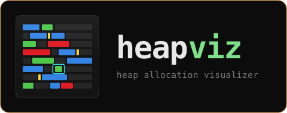
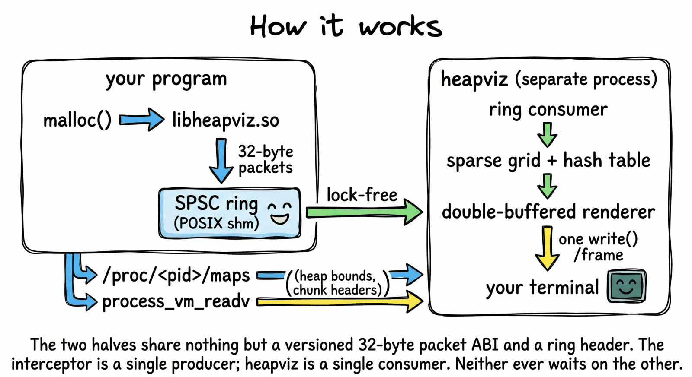

<div align="center">



**Watch your program's heap breathe, in real time, in your terminal.**

[](https://en.cppreference.com/w/cpp/20)
[](https://cmake.org/)
[](#requirements)
[](#requirements)
[](LICENSE)
[](ROADMAP.md)

</div>

---

## What is heapviz?

**heapviz** is a terminal heap profiler for Linux that renders a live, spatial
map of your process's memory as it runs. Every character cell on screen is a
fixed span of virtual address space; every colour is an allocation's current
state. Allocate, and a block flashes green where it landed. Free it, and the
space flashes red before fading out. Leave it alive, and it settles to blue.

Heap behaviour you normally infer from numbers (churn, fragmentation,
allocator reuse patterns, leaks) becomes something you just *look at*.

<div align="center">

<br>
<sub><i>Design target. heapviz is pre-alpha and this interface is not yet implemented.<br>
See <a href="ROADMAP.md">ROADMAP.md</a> for what's actually built.</i></sub>
</div>

---

## Goals

Most heap profilers make you choose between detail and speed. Valgrind's
Massif gives you exquisite data at 20–100× slowdown. Sampling profilers stay
fast but blur exactly the churn you're trying to see. heapviz is built around
the position that you shouldn't have to pick.

Three design commitments drive everything.

**1. The profiler is a guest in your process.** The `LD_PRELOAD` interceptor
performs zero dynamic allocations while generating telemetry. It writes
fixed-size event packets straight into a lock-free shared-memory ring buffer
using atomic operations. If the ring is full it drops the event and increments
a counter. It never blocks your program, never takes a lock your threads
contend on, and never allocates from the allocator it's instrumenting.
Target: under 50 ns added per allocation.

**2. The renderer earns its frame budget.** The TUI keeps two terminal
framebuffers and diffs them, emitting escape codes only for cells that actually
changed, and only emitting a colour sequence when the colour actually changed
from the previous cell. One `write(2)` syscall per frame, no tearing.
Target: 60 FPS at under 1 ms CPU per frame.

**3. A 64-bit address space fits on your screen.** Rather than tracking
millions of addresses individually, heapviz buckets them into a coarse-grained
sparse grid whose granularity adapts to your terminal size and the heap's span.
Live chunks live in an open-addressing Robin Hood hash table for O(1) lookup.

And one honesty commitment: if heapviz drops telemetry events, it says so,
loudly, on screen. A profiler that quietly lies about what it missed is worse
than no profiler.

---

## What it does

- **Spatial heap map:** the whole heap as a colour-coded grid, each cell a
  fixed byte span that scales to your terminal
- **Allocation heatmap:** fresh `malloc` pulses green, settles to blue as it
  ages; `free` flashes red then fades, so you can see the allocator reusing
  space
- **Chunk overhead visualisation:** yellow markers show glibc `ptmalloc` chunk
  headers, making the gap between what you asked for and what you got visible
- **Interactive inspector:** move a cursor with `h`/`j`/`k`/`l` and read any
  chunk's address, requested size, real size, status, and lifetime
- **Fragmentation analysis:** live percentage plus the largest contiguous free
  gap, because "can I still allocate 1 MB" is what people actually want to know
- **Snapshot & leak diff:** mark a point in time, then highlight everything
  allocated since that's still alive
- **Telemetry health:** ring buffer utilisation and dropped-event count, always
  visible

### Interception coverage

`malloc` · `free` · `calloc` · `realloc` · `posix_memalign` · `aligned_alloc` ·
`memalign` · `valloc` · `pvalloc`, plus everything that reaches them
transitively (`strdup`, `asprintf`, `getline`, C++ `operator new`).

---

## How it works

<div align="center">
/maps and process_vm_readv for heap bounds and
          chunk headers. The two halves share nothing but a versioned 32-byte packet ABI and
          a ring header. The interceptor is a single producer; heapviz is a single consumer.
          Neither ever waits on the other.">
</div>

---

## Requirements

| | |
|---|---|
| **OS** | Linux (kernel 3.2+ for `process_vm_readv`) |
| **libc** | glibc / `ptmalloc`; chunk-header decoding is allocator-specific |
| **Terminal** | UTF-8, 24-bit TrueColor recommended (256-colour and ASCII fallbacks planned) |
| **Build** | CMake 3.20+, a C++20 compiler (GCC 11+ / Clang 14+) |

**Known limits, stated up front:** `LD_PRELOAD` is ignored for setuid binaries
and has nothing to hook in statically linked ones. Chunk-header inspection
needs same-uid access or `CAP_SYS_PTRACE`, and `yama/ptrace_scope=1` will block
it. heapviz degrades to interceptor-only data rather than failing.

---

## Installation

> **Not yet released.** heapviz is pre-alpha; there is no build to install.
> Packaging, release binaries, and build-from-source instructions land with
> **v0.1.0**. Track progress in [ROADMAP.md](ROADMAP.md).

Planned usage, once it ships:

```bash
# launch a program under heapviz
heapviz -- ./my_app --some-flag

# or attach to something already running libheapviz.so
heapviz --pid 41820
```

---

## Keybindings

The full set is planned for v0.1.0. The last column says what works today, so
that pressing a key and seeing nothing happen is answerable without reading the
roadmap.

| Key | Action | |
|-----|--------|---|
| `h` `j` `k` `l` | Move the inspector cursor one cell | working |
| `H` `J` `K` `L` | Move ten cells or ten rows | working |
| `n` `N` | Jump to next / previous non-empty cell | working |
| `g` `G` | Jump to heap start / end | working |
| `Tab` | Cycle chunks within the selected cell | working |
| `Space` | Pause the display | planned |
| `s` | Take a snapshot | planned |
| `d` | Toggle leak diff against the snapshot | planned |
| `r` | Reset statistics | planned |
| `?` | Help | planned |
| `q` | Quit | working |

Horizontal movement runs along the address space rather than stopping at the
edge of the terminal, so `h` in the first column steps onto the last cell of the
row above — that cell really is the previous one. Vertical movement keeps the
column. Resizing the terminal keeps the cursor on the same *address*, not the
same square.

### If the terminal is left in a strange state

heapviz restores termios, the cursor, and the alternate screen on every exit
path it can reach: quitting with `q`, `SIGINT`, `SIGTERM`, `SIGHUP`, a crash,
or an uncaught exception. `SIGKILL` cannot be caught by anything, so
`kill -9 heapviz` is the one case that can leave your shell without an echo or
a visible cursor. Recover with:

```sh
reset        # or, if that is unavailable:
stty sane
```

Typing it blind works even when the echo is off.

---

## Project status

Pre-alpha, and under active construction, but it runs: `heapviz -- ./your_app`
and `heapviz --pid N` both attach to a real process and draw its heap. The
`LD_PRELOAD` interceptor captures allocations at about 31 ns per call. The
terminal engine underneath is raw mode, a double-buffered grid, a differential
renderer that puts one write on the wire per frame, and a paced event loop that
handles resizing and idles at close to no CPU. Above that sit the spatial map,
a movable cursor, a chunk inspector and a telemetry metrics panel.

Not there yet: fragmentation analysis, snapshots and leak diffing, pausing, and
the visual polish the mockup above shows. `heapviz --term-check` exercises the
terminal layer and the map against a synthetic heap without needing a target.

[**ROADMAP.md**](ROADMAP.md) tracks 212 tasks across 8 milestones, from the
shared-memory ABI through the interceptor, sparse grid, ANSI engine,
interactivity, and visual polish. [**CHANGELOG.md**](CHANGELOG.md) records what
has actually shipped.

---

## Contributing

Early days, and the architecture is still settling. If you want to help, the
roadmap's open decisions (§2) and the M1 bootstrap problem are where a second
opinion would help most.

## License

[GNU General Public License v3.0](LICENSE)
